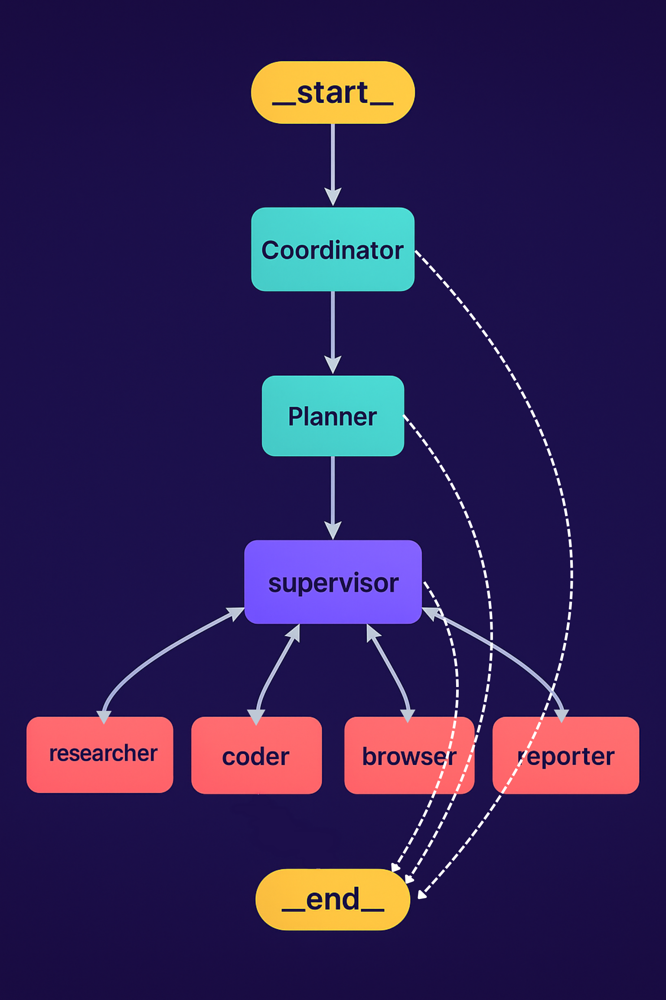

# AfiAgent: An Autonomous AI Automation Framework

[](https://www.python.org/downloads/)
[](https://opensource.org/licenses/MIT)

> Originating from open source, giving back to open source

AfiAgent is a robust, community-driven AI automation framework designed to empower users with advanced capabilities for complex task execution. It seamlessly integrates large language models (LLMs) with a suite of professional tools, including web search, content scraping, and Python code execution. Our core mission is to leverage the power of open-source contributions while actively giving back to the vibrant community that underpins this technology.

## Overview

### Core Architecture

AfiAgent employs a sophisticated multi-agent system, orchestrated by a central Supervisor agent. This layered architecture enables the decomposition and efficient execution of intricate tasks by delegating responsibilities to specialized agents. The collaborative framework includes:

*   **Coordinator:** The initial point of contact, handling user interactions and routing tasks.
*   **Planner:** Analyzes tasks and devises strategic execution plans.
*   **Supervisor:** Oversees and manages the execution flow across all agents.
*   **Researcher:** Gathers and analyzes information from various sources.
*   **Programmer (Coder):** Responsible for code generation, modification, and execution.
*   **Browser:** Facilitates web navigation and information retrieval.
*   **Reporter:** Compiles and summarizes workflow outcomes and reports.



### Key Capabilities

AfiAgent offers a comprehensive set of features designed to enhance automation and problem-solving:

*   **Advanced LLM Integration:**
    *   Supports Google Gemini API (gemini-2.0-flash) with automatic fallback for non-English APIs.
    *   OpenAI-compatible API interface for broader model compatibility.
    *   Multi-tiered LLM system adapts to varying task complexities (reasoning, basic, visual language models).
*   **Intelligent Search & Retrieval:**
    *   Leverages Tavily API for efficient web search.
    *   Advanced content extraction capabilities.
*   **Integrated Python Environment:**
    *   Built-in Python REPL for interactive code execution.
    *   Secure code execution environment.
    *   Utilizes `uv` for streamlined package management.
*   **Dynamic Workflow Management:**
    *   Visual workflow diagrams for clarity and oversight.
    *   Sophisticated multi-agent orchestration.
    *   Effective task assignment and monitoring.

### Why Choose AfiAgent?

We firmly believe in the transformative power of open-source collaboration. AfiAgent's development has been significantly propelled by the contributions of outstanding open-source projects and communities. We are dedicated to reciprocating this support by fostering an environment of continuous improvement and community engagement. We welcome all forms of contributions, from minor documentation enhancements and bug fixes to new feature suggestions and problem reports.

### Demonstration

Witness AfiAgent in action with a practical example:

> **Task:** Calculate the influence index of DeepSeek R1 on HuggingFace. This index can be designed by considering a weighted sum of factors such as followers, downloads, and likes.

[](./assets/demo.mp4)

*   [Watch on YouTube](https://youtu.be/)
*   [Download Video](https://github.com/afiagent/afiagent/blob/main/assets/demo.mp4)

## Requirements & Dependencies

Before setting up AfiAgent, ensure you have the following prerequisite installed:

*   **`uv` Package Manager:** AfiAgent relies on `uv` for efficient dependency management and virtual environment creation. If you don't have `uv` installed, you can find installation instructions on its official GitHub repository or documentation.

## Installation & Setup

Follow these steps to get AfiAgent up and running on your local machine. This guide covers setting up the virtual environment, installing dependencies, and configuring necessary API keys.

### Quick Start

For a rapid deployment, execute the following commands:

```bash
# Clone the repository
git clone https://github.com/afiagent/afiagent.git
cd afiagent

# Create and activate a virtual environment using uv
uv python install 3.12
uv venv --python 3.12

# Activate the virtual environment
source .venv/bin/activate  # For Windows: .venv\Scripts\activate

# Install project dependencies
uv sync

# Configure environment variables
cp .env.example .env
# Open the .env file and populate it with your API keys

# Run the project
uv run main.py
```

### Detailed Installation Steps

AfiAgent leverages `uv` as its primary package manager to simplify dependency handling.

1.  **Create and Activate Virtual Environment:**
    ```bash
    uv python install 3.12
    uv venv --python 3.12
    ```
    Activate the environment:
    *   For Unix/macOS:
        ```bash
        source .venv/bin/activate
        ```
    *   For Windows:
        ```bash
        .venv\Scripts\activate
        ```

2.  **Install Project Dependencies:**
    ```bash
    uv sync
    ```

### Configuration

AfiAgent utilizes a three-tiered LLM system for distinct functionalities: complex reasoning, basic text tasks, and visual language processing. To configure these models and other tools, create a `.env` file in the project's root directory and define the following environment variables:

```ini
# Reasoning LLM Configuration (for complex analytical tasks)
REASONING_MODEL=gemini-2.0-flash
GEMINI_API_KEY=your_gemini_api_key

# Tool API Keys
TAVILY_API_KEY=your_tavily_api_key

# Browser Configuration (at folder: src/tools/browser.py)
config=BrowserConfig(
chrome_instance_path="/usr/bin/chromium-browser" //Change to your path
)

# Code-Server Configuration (at folder: src/tools/code_server_manager.py)
config=BrowserConfig(
"/usr/bin/code-server",  # or just "code-server" if in PATH
)
```

**Important Notes on Configuration:**

*   The system dynamically selects models based on task requirements:
    *   **Reasoning LLM:** Employed for intricate decision-making and analysis (defaults to Gemini).
    *   **Basic LLM:** Used for simpler text-based operations.
    *   **Visual Language LLM:** Dedicated to tasks involving image comprehension.
*   If the reasoning model detects a Chinese-language API, it will automatically fall back to Gemini.
*   For non-Gemini basic and visual language models, their base URLs can be independently customized.
*   Each LLM can be configured with its own distinct API key.
*   Tavily search is pre-configured to return up to 5 results. Obtain your Tavily API key from [app.tavily.com](https://app.tavily.com/).

You can use the provided example file as a template:

```bash
cp .env.example .env
```

### Configuring Git Pre-commit Hooks

AfiAgent includes pre-commit hooks to enforce code quality and formatting standards before each commit. To set these up:

1.  **Make the pre-commit script executable:**
    ```bash
    chmod +x pre-commit
    ```

2.  **Install the pre-commit hook:**
    ```bash
    ln -s ../../pre-commit .git/hooks/pre-commit
    ```

These pre-commit hooks will automatically:
*   Execute code linting (`make lint`).
*   Format the codebase (`make format`).
*   Re-add any reformatted files to the staging area.
*   Prevent commits if linting or formatting checks fail.

## Usage Examples

This section demonstrates how to run AfiAgent for basic operations and how to interact with its API server.

### Basic Execution

To run AfiAgent with its default settings, simply execute the main script:

```bash
uv run main.py
```

## Advanced Features

AfiAgent is highly customizable, allowing users to fine-tune its behavior and integrate with external tools.

### Advanced Configuration

AfiAgent's behavior can be extensively customized through various configuration files located in the `src/config` directory:

*   `env.py`: Manages LLM models, API keys, and base URLs.
*   `tools.py`: Allows customization of tool-specific settings (e.g., Tavily search result limits).
*   `agents.py`: Enables modification of agent team composition and system prompts.

### Agent Prompt System

AfiAgent employs a sophisticated prompt system, housed in the `src/prompts` directory, to precisely define the roles, behaviors, and responsibilities of each agent.

#### Core Agent Roles and Responsibilities

*   **Supervisor (`src/prompts/supervisor.md`):** The orchestrator of the agent team. It coordinates tasks, analyzes requests, and assigns them to the most suitable expert agent. The Supervisor is also responsible for determining task completion and managing workflow transitions.
*   **Researcher (`src/prompts/researcher.md`):** Specializes in information gathering through web searches and data collection. This agent utilizes Tavily search and web scraping functionalities, strictly avoiding mathematical computations or file operations.
*   **Programmer (`src/prompts/coder.md`):** Functions as a professional software engineer, focusing on Python and bash scripting. Its responsibilities include:
    *   Execution and analysis of Python code.
    *   Execution of shell commands.
    *   Technical troubleshooting and implementation.
*   **File Manager (`src/prompts/file_manager.md`):** Handles all file system operations, with a particular emphasis on formatting and storing content in correct Markdown format.
*   **Browser (`src/prompts/browser.md`):** An expert in web interaction, responsible for:
    *   Website navigation.
    *   Page interactions (clicks, input, scrolling).
    *   Content extraction from web pages.

#### Prompt System Architecture

The prompt system leverages a templating engine (`src/prompts/template.py`) to:
*   Load role-specific Markdown templates.
*   Manage variable substitutions (e.g., current time, team member information).
*   Format the system prompts for each individual agent.

Each agent's prompt is defined in a separate Markdown file, facilitating easy modification of their behavior and responsibilities without altering the core codebase.

### Code Server Integration

AfiAgent now features integrated support for automated code execution via Code Server. This allows agents to execute and test generated code within an isolated and interactive environment, significantly enhancing reliability and accuracy.

#### How the Integration Works

When an agent receives a request involving code generation or execution, the following sequence occurs:
1.  Code Server is launched within the sandboxed environment.
2.  The generated code is transmitted to Code Server for execution.
3.  The output and execution results from Code Server are captured.
4.  These results are then utilized by the agent to proceed with the task or provide feedback to the user.

#### Manual Code Server Launch

For development or debugging purposes, Code Server can be launched manually using the following command:

```bash
PASSWORD=4f9c26af9e42b1b8 /usr/bin/code-server \
  --bind-addr 0.0.0.0:8329 \
  --auth password \
  --disable-workspace-trust \
  /home/ubuntu/AfiAgent
```

*   `PASSWORD=4f9c26af9e42b1b8`: Sets the password for Code Server access. This password should be kept confidential.
*   `--bind-addr 0.0.0.0:8329`: Binds Code Server to all available network interfaces on port 8329, enabling external access from the sandbox.
*   `--auth password`: Activates password-based authentication.
*   `--disable-workspace-trust`: Disables the workspace trust feature, which is useful for rapid development environments.
*   `/home/ubuntu/AfiAgent`: Specifies the workspace directory for Code Server. This is the root directory of the AfiAgent project.

## Troubleshooting

*(Content to be added based on common issues and their resolutions)*

## Contributions & License

### Contributions

We welcome all forms of contributions to AfiAgent! Whether you're fixing a typo, enhancing documentation, or adding new features, your assistance is greatly appreciated. Please refer to our [Contribution Guidelines](CONTRIBUTING.md) to get started.

### License

This project is open-source, distributed under the [MIT License](LICENSE).

### Acknowledgements

Special thanks to all the open-source projects and contributors who have made AfiAgent possible. We stand on the shoulders of giants.
